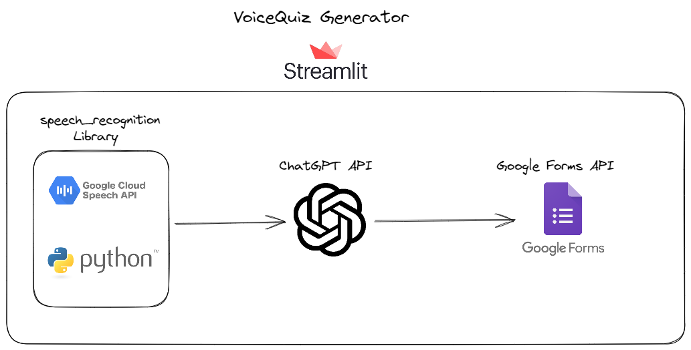

## Setup and Usage

1. Clone the repository:

   ```shell
   git clone https://github.com/Heisenberghj7/VoiceQuiz-Generator.git
2. Activate the virtual environnement VoiceQuizEnv: In git bash and in the project folder type: 
   ```shell
   source VoiceQuizEnv/Scripts/Activate
3. Set up your OpenAI API credentials: Sign up for an account at OpenAI (https://openai.com/). Obtain an API key.
   Create a file and name it openai_key.txt and put the API_KEY there.
4. Run the application:
   - streamlit run StreamlitApp.py
5. Click on the "Start Recording" button to begin the audio recording.
6. Speak the topic and number of questions for the quiz.